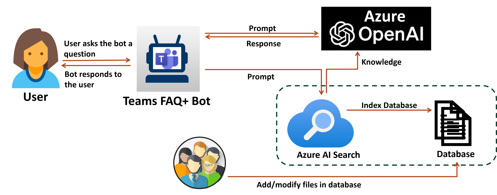

# FaqBot
[](https://github.com/codespaces/new?hide_repo_select=true&ref=main&repo=830777765&devcontainer_path=.devcontainer%2Fdevcontainer.json&resume=1)
<!-- @import "[TOC]" {cmd="toc" depthFrom=1 depthTo=6 orderedList=false} -->

<!-- code_chunk_output -->

## Chatbot with Knowledge Base and Expert Support
This project implements a chatbot that interacts with users, searches a knowledge base for answers, and escalates queries to a Teams channel when asked. Experts can then engage with users and update the knowledge base dynamically.

## Interacting with the bot

- **Automated Query Handling**: The bot responds to user queries by searching a pre-configured knowledge base.
- **Expert Support**: Users can request to speak with an expert, the bot then posts the user's query to a specified Microsoft Teams channel. Experts can assign user requests to themselves and initiate a chat on Teams.
- **Dynamic Knowledge Base Updates**: Experts can add new information to the knowledge base based on user interactions.

## How the knowledge base works

1. **User Query**:
    - The user asks the bot a question.
2. **Prompt Generation**:
    - The bot generates a prompt based on the user's question.
3. **Azure AI Search**:
    - The prompt is sent as a query to Azure AI Search to find relevant information.
    - The top ranked search results are sent to the LLM.
4. **Azure OpenAI**:
   - The promt is also sent to Azure OpenAI model to set the context and intent.
   - The model provides a generative response which is sent back to the user.
    

## Setting up the app in Github Codespaces
1. Click Open in GitHub Codespaces badge above to create a codespace for the sample app. Wait for the codespace to be setup, it may take a couple of minutes.
2. Using the Teams Toolkit extension, sign in to your Microsoft 365 account and Azure account under ```ACCOUNTS```.
3. [Set up your knowledge base using Azure AI resources](#setting-up-your-knowledge-base).
4. [Populate the environment files](#populating-the-environment-files).
5. Press **Ctrl+Shift+D** to open the ```Run and Debug``` menu. Select ```Debug``` and press ```F5``` or click on the play button.
6. Download the zip file ```appPackage/build/appPackage.local.zip``` and [sideload the app to Teams personal chat](#sideloading-the-app-to-teams-personal-chat) and  [sideload the app to Teams Channel](#sideloading-the-app-to-teams-channel)
   
## Setting up the app locally
1. Clone the repository
   ```git clone https://github.com/t-mbindra/chat-with-your-data.git```
2. Install [Python 3.11](https://www.python.org/downloads/), [Node.js](https://nodejs.org/) and [Rust](https://www.rust-lang.org/tools/install).
4. Install  [Poetry](https://python-poetry.org/docs/#installation) and [Azure CLI](https://learn.microsoft.com/en-us/cli/azure/install-azure-cli).
5. Open the project folder in [Visual Studio Code](https://code.visualstudio.com/download).
6. Install the [Teams Toolkit](https://marketplace.visualstudio.com/items?itemName=TeamsDevApp.ms-teams-vscode-extension) and [Python](https://marketplace.visualstudio.com/items?itemName=ms-python.python) extensions.
8. Run
   ```poetry install```
9. Run
   ```poetry build```
3. [Set up your knowledge base using Azure AI resources](#setting-up-your-knowledge-base).
4. [Populate the environment files](#populating-the-environment-files).
11. Using the Teams Toolkit extension, sign in to your Microsoft 365 account and Azure account under ```ACCOUNTS```.
12. Press **Ctrl+Shift+D** to open the ```Run and Debug``` menu. Press ```F5``` or click on the play button. Also, [sideload the app to Teams Channel](#sideloading-the-app-to-teams-channel)

## Deploying the app on Azure
Instead of the ```Debug``` or ```F5``` flow, you can deploy the app on Azure:
1. Using the Teams Toolkit Extension tab, click on ```Provision``` followed by ```DEPLOY``` under ```LIFECYCLE```. You will be asked to select the subscription and resource group for provisioning.
2. Using the zip file ```appPackage/build/appPackage.dev.zip```, [sideload the app to Teams personal chat](#sideloading-the-app-to-teams-personal-chat) and [sideload the app to Teams Channel](#sideloading-the-app-to-teams-channel)

## Setting up your knowledge base
1. Run```sh deploy.sh``` in the terminal to deploy Azure Saerch and Azure OpenAI. You will be prompted to login to Azure and select a subscription.
2. Add all your files to the ```src/data``` folder and URLs to ```src/indexer/URL.txt``` and run ```python ./src/indexer/setup.py```.
3. To delete the exisiting index, run ```python .src/indexer/delete.py```.

## Populating the environment files
1. You need to populate the environment variables in ```env/.env.local.user``` if you are using the ```Debug``` or ```F5``` flow. Else, populate the environment variables in ```env/.env.dev.user``` if you are dpleoying the app on Azure.
2. Go to the the [Azure portal](https://ms.portal.azure.com/) and navigate to the resource group ```FaqBot```. 
3. Go to the ```teamsazureopenai-cognitive``` resource. Select the ```Keys and Endpoints``` tab under ```Resource Management```. Populate the ```SECRET_AZURE_OPENAI_KEY, SECRET_AZURE_OPENAI_ENDPOINT``` using ```Key 1``` and ```Endpoint```.   
4. Go to the ```teamsazureopenai-search``` resource. Populate ```SECRET_AZURE_SEARCH_ENDPOINT``` from the ```Url``` given. Select the ```Keys``` tab under ```Settings```.  Populate ```SECRET_AZURE_SEARCH_KEY``` using the ```Primary admin key```.

## Sideloading the app to Teams Personal Chat:
1. Go to your Teams app and click on the ```Apps``` icon. Select ```Manage your apps``` followed by ```Upload an app```.
2. Select ```Upload a custom app``` and open the relevant zip file. Click on ```Add``` when prompted.

## Sideloading the app to Teams Channel:
1. Go to the channel where you want to raise requests for help. Click on the ```Apps``` icon. Select ```Got more apps``` followed by ```Manage your apps```.
2. Click on ```Upload an app``` and open the relevant zip file.  Click on ```Add``` when prompted. Select the correct channel and click on ```Go```

>[!Note]
> Check the status of all your local bots on [Microsoft Bot Framework](https://dev.botframework.com/bots).
> Check the status of all your Teams apps on [Teams Developer Portal](https://dev.teams.microsoft.com/apps).
> Check the status of all Azure resources on [Azure Portal](https://portal.azure.com/#home) by navigating to the relevant resource group.

> If you do not have permission to upload custom apps (sideloading), Teams Toolkit will recommend creating and using a Microsoft 365 Developer Program account - a free program to get your own dev environment sandbox that includes Teams.
